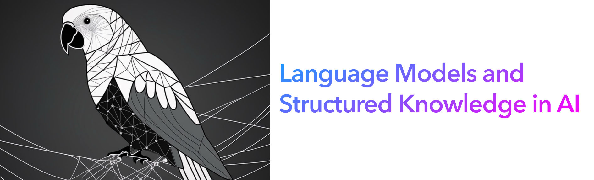
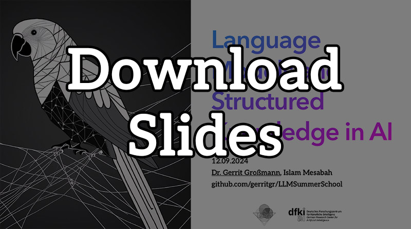
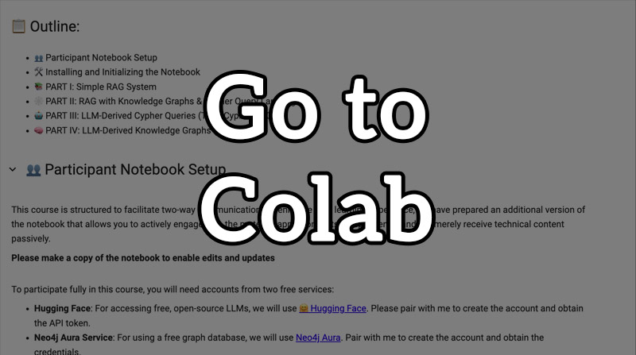

 

Official Repo of the "Language Models and Structured Knowledge in AI" Talk at the [4th Inria-DFKI European Summer School on AI (IDESSAI 2024)](https://idessai.eu/tracka-largeaimodels/).

## Content

 &nbsp; 

## References
-[Exploring Large Language Models for Knowledge Graph Completion (Yao et al., 2024)](https://arxiv.org/abs/2306.08302)
-[Iterative Zero-Shot LLM Prompting for Knowledge Graph Construction (Carta et al., 2023)](https://arxiv.org/abs/2306.08302)
-[KGLens: Towards Efficient and Effective Knowledge Probing of Large Language Models with Knowledge Graphs (Zheng et al., 2023)](https://arxiv.org/abs/2306.08302)

-[Reasoning on Graphs: Faithful and Interpretable Large Language Model Reasoning (Luo et al., 2024)](https://arxiv.org/abs/2306.08302)
-[Graph Language Models (Plenz et al., 2024)](https://arxiv.org/abs/2306.08302)
-[Mitigating Large Language Model Hallucinations via Autonomous Knowledge Graph-based Retrofitting (Guan et al., 2023)](https://arxiv.org/abs/2306.08302)
-[SKILL: Structured Knowledge Infusion for Large Language Models (Moiseev, 2022)](https://arxiv.org/abs/2306.08302)
-[Knowledge-Augmented Language Model Prompting for Zero-Shot Knowledge Graph Question Answering (Baek et al., 2023)](https://arxiv.org/abs/2306.08302)
-[From Local to Global: A Graph RAG Approach to Query-Focused Summarization (Edge et al., 2024)](https://arxiv.org/abs/2306.08302)
-[HybridRAG: Integrating Knowledge Graphs and Vector Retrieval Augmented Generation for Efficient Information Extraction (Sarmah et al., 2024)](https://arxiv.org/abs/2408.04948)

### Surveys

- [Unifying Large Language Models and Knowledge Graphs: A Roadmap (Pan et al., 2023)](https://arxiv.org/abs/2306.08302)
- [Graph Machine Learning in the Era of Large Language Models (Fan et al., 2024)](https://arxiv.org/abs/2404.14928)

### Tutorials

- [ArangoDB - LLMs With Knowledge Graph (YouTube)](https://www.youtube.com/watch?v=DkbX8O9zd_8)
- [AI Engineer World's Fair 2024 - Talk by Emil Eifrem (highly recommended)](https://www.ai.engineer/worldsfair/2024/schedule)
- [Neo4j Graphacademy](https://graphacademy.neo4j.com/)
- [ACL 2023 Tutorial: Complex Reasoning in Natural Language (Wenting Zhao)](https://wenting-zhao.github.io/complex-reasoning-tutorial/)
